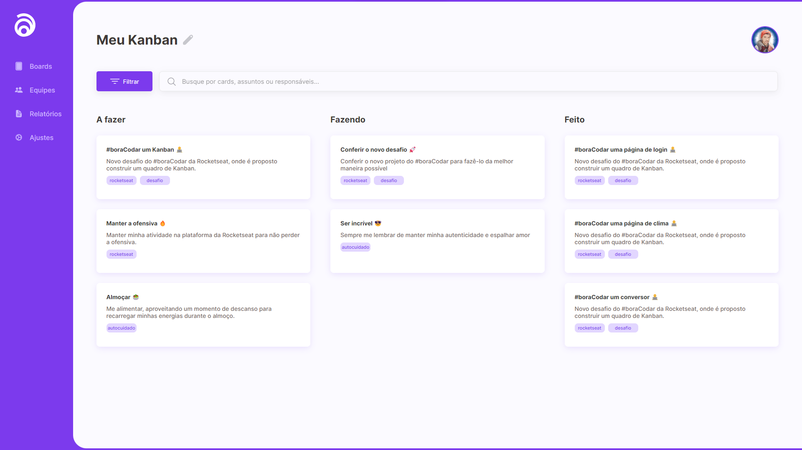

<h1 align="center"> #boraCodar - Desafio #12  - Kanban</h1>

  <a href="#-tecnologias">👨‍💻 Tecnologias</a>&nbsp;&nbsp;&nbsp;|&nbsp;&nbsp;&nbsp;
  <a href="#-projeto">📄 Projeto</a>&nbsp;&nbsp;&nbsp;|&nbsp;&nbsp;&nbsp;
  <a href="#-layout">📱 Layout</a>&nbsp;&nbsp;&nbsp;|&nbsp;&nbsp;&nbsp;
  <a href="#-licença">🪪 Licença</a></a>&nbsp;&nbsp;&nbsp;|&nbsp;&nbsp;&nbsp;
  <a href="#-licença">☁️ Deploy</a>

 

  
  

## 👨‍💻 Tecnologias

Esse projeto foi desenvolvido com as seguintes tecnologias:

- HTML e CSS
- Java Script
- Git e Github
- Figma

 

## 📄 Projeto

 

Este projeto trata-se de uma aplicação de Kanban com as seguintes:

funcionalidades:

- [x] Lista de tarefas (Cards) por Status (Todo, Doing, Done)

Funcionalidades na fila de implementação:

- [ ] Overflow personalzar barra Scrollbar por status
- [ ] Cortar textos longos, deixar 3 linhas somente no card com ... no final do texto
- [ ] Drag and Drop de tarefas (Cards)
- [ ] Busca/Pesquisa de tarefas (Título e Descrição)
- [ ] Adicionar uma nova tarefa (Card)
- [ ] Remover uma tarefa (Card)
- [ ] Filtro por tags de tarefas (Cards)
- [ ] Editar/Atualizar tarefa (Card)

 

## 📱 Layout

Você pode visualizar o layout do projeto através [DESSE LINK](<https://www.figma.com/file/6pU1Xep1fnmMMCFfLyAxwv/%23boracodar---Desafio-12-(Community)?type=design&node-id=11-31&t=uAmcSyEq40GaFB1i-0>). É necessário ter conta no [Figma](https://figma.com) para acessá-lo.

 

## 🪪 Licença

Esse projeto está sob a licença MIT.

 

## ☁️ Deploy

Você pode acessar o Website do projeto através do link: 
<a href= "https://a1exlima.github.io/-boraCodar-desafio-12-Kanban/" target="_blank"> Clique aqui ⏯ </a>

 

---

Feito com  ♥  by Alex Lima
